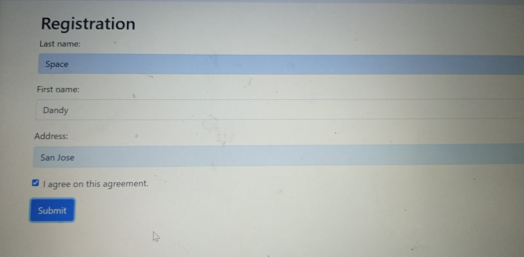

# LogApp

**Name: ** Diana Rodriguez

___

**Description** 

This website is particularly about the tracking the list of registered people, which upon sign-up or registering on the form, the person details will be saved up on the database and you will see the details on the Guestbook List.

***

**Visuals**

___

**Installation**

On installing or connecting the website to database, on the config you will connect the particular details to connect it to the database, but first you should create a database on your localhost.

Here is an example of the particular code for connecting to database 
<?php
	define('ROOT_URL', 'index.php');
	define('DB_HOST', 'sql6.freesqldatabase.com');
	define('DB_USER', 'sql6479680');
	define('DB_PASS', '7H12eGeIUg');
	define('DB_NAME', 'sql6479680');

These are the **sub-requirements** you will need.

1. Code editor such as Visual Studio Code
2. Wamp or Xampp
3. Laptop
4. Internet Connection

___

**Author**

**Instructed by** Maam Kristine Joy Martinez
**Student** Diana Rodriguez